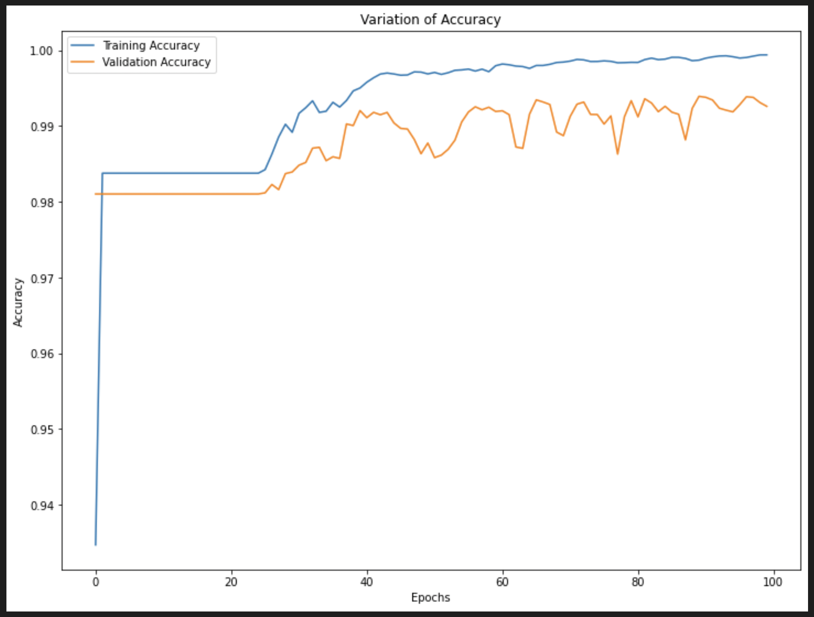

# **Bone Fracture Detection**

## **Objective**

The objective of this project is to create a deep neural network based web application. This application should take the input as the x-ray images, the output should be the X-ray images marked with the localization of the possible fractured bones in the X-ray images. The number of models I have included are two;

- First model is a simple encoder decoder based model
- Second model has the same architecture of Unet model

## **Dataset**

The dataset is very rare for this type of task, we came across one dataset which is quite small, a total of 237 samples. I had two options on that point:

- One was to use that dataset or
- Create a new dataset manually

I chose the first option because I am no expert in reading x-rays properly and I might have missed some samples for correct labelling of the fractured bones. Although the dataset is small and I was a bit sceptical in the beginning, after all everything came out well.

## **Input and output**

The standard size we have decided for my model input will be close to 256x256, the output size will also be the same (256x256).

## **Model**

First model I trained was a simple encoder decoder model, the architecture of the model is listed below;

## **Model: &quot;Simple Encoder decoder&quot;**

**\_\_\_\_\_\_\_\_\_\_\_\_\_\_\_\_\_\_\_\_\_\_\_\_\_\_\_\_\_\_\_\_\_\_\_\_\_\_\_\_\_\_\_\_\_\_\_\_\_\_\_\_\_\_\_\_\_\_\_\_\_\_\_\_\_**

**Layer (type) Output Shape Param #**

**=================================================================**

**input\_2 (InputLayer) [(None, 256, 256, 3)] 0**

**conv2d\_15 (Conv2D) (None, 256, 256, 16) 448**

**dropout\_7 (Dropout) (None, 256, 256, 16) 0**

**conv2d\_16 (Conv2D) (None, 256, 256, 16) 2320**

**max\_pooling2d\_3 (MaxPooling (None, 128, 128, 16) 0**

**2D)**

**conv2d\_17 (Conv2D) (None, 128, 128, 32) 4640**

**dropout\_8 (Dropout) (None, 128, 128, 32) 0**

**conv2d\_18 (Conv2D) (None, 128, 128, 32) 9248**

**max\_pooling2d\_4 (MaxPooling (None, 64, 64, 32) 0**

**2D)**

**conv2d\_19 (Conv2D) (None, 64, 64, 128) 36992**

**dropout\_9 (Dropout) (None, 64, 64, 128) 0**

**conv2d\_20 (Conv2D) (None, 64, 64, 128) 147584**

**max\_pooling2d\_5 (MaxPooling (None, 32, 32, 128) 0**

**2D)**

**conv2d\_21 (Conv2D) (None, 32, 32, 256) 295168**

**dropout\_10 (Dropout) (None, 32, 32, 256) 0**

**conv2d\_22 (Conv2D) (None, 32, 32, 256) 590080**

**conv2d\_transpose\_3 (Conv2DT (None, 64, 64, 128) 131200**

**ranspose)**

**conv2d\_23 (Conv2D) (None, 64, 64, 128) 147584**

**dropout\_11 (Dropout) (None, 64, 64, 128) 0**

**conv2d\_24 (Conv2D) (None, 64, 64, 128) 147584**

**conv2d\_transpose\_4 (Conv2DT (None, 128, 128, 32) 16416**

**ranspose)**

**conv2d\_25 (Conv2D) (None, 128, 128, 32) 9248**

**dropout\_12 (Dropout) (None, 128, 128, 32) 0**

**conv2d\_26 (Conv2D) (None, 128, 128, 32) 9248**

**conv2d\_transpose\_5 (Conv2DT (None, 256, 256, 16) 2064**

**ranspose)**

**conv2d\_27 (Conv2D) (None, 256, 256, 16) 2320**

**dropout\_13 (Dropout) (None, 256, 256, 16) 0**

**conv2d\_28 (Conv2D) (None, 256, 256, 16) 2320**

**conv2d\_29 (Conv2D) (None, 256, 256, 2) 34**

**=================================================================**

**Total params: 1,554,498**

**Trainable params: 1,554,498**

**Non-trainable params: 0**

**\_\_\_\_\_\_\_\_\_\_\_\_\_\_\_\_\_\_\_\_\_\_\_\_\_\_\_\_\_\_\_\_\_\_\_\_\_\_\_\_\_\_\_\_\_\_\_\_\_\_\_\_\_\_\_\_\_\_\_\_\_\_\_\_\_**

## **Model: &quot;Unet Model&quot;**

**\_\_\_\_\_\_\_\_\_\_\_\_\_\_\_\_\_\_\_\_\_\_\_\_\_\_\_\_\_\_\_\_\_\_\_\_\_\_\_\_\_\_\_\_\_\_\_\_\_\_\_\_\_\_\_\_\_\_\_\_\_\_\_\_\_\_\_\_\_\_\_\_\_\_\_\_\_\_\_\_\_\_\_\_\_\_\_\_\_\_\_\_\_\_\_\_\_\_**

**Layer (type) Output Shape Param # Connected to**

**==================================================================================================**

**input\_1 (InputLayer) [(None, 256, 256, 3 0 []**

**)]**

**conv2d (Conv2D) (None, 256, 256, 16 448 [&#39;input\_1[0][0]&#39;]**

**)**

**dropout (Dropout) (None, 256, 256, 16 0 [&#39;conv2d[0][0]&#39;]**

**)**

**conv2d\_1 (Conv2D) (None, 256, 256, 16 2320 [&#39;dropout[0][0]&#39;]**

**)**

**max\_pooling2d (MaxPooling2D) (None, 128, 128, 16 0 [&#39;conv2d\_1[0][0]&#39;]**

**)**

**conv2d\_2 (Conv2D) (None, 128, 128, 32 4640 [&#39;max\_pooling2d[0][0]&#39;]**

**)**

**dropout\_1 (Dropout) (None, 128, 128, 32 0 [&#39;conv2d\_2[0][0]&#39;]**

**)**

**conv2d\_3 (Conv2D) (None, 128, 128, 32 9248 [&#39;dropout\_1[0][0]&#39;]**

**)**

**max\_pooling2d\_1 (MaxPooling2D) (None, 64, 64, 32) 0 [&#39;conv2d\_3[0][0]&#39;]**

**conv2d\_4 (Conv2D) (None, 64, 64, 64) 18496 [&#39;max\_pooling2d\_1[0][0]&#39;]**

**dropout\_2 (Dropout) (None, 64, 64, 64) 0 [&#39;conv2d\_4[0][0]&#39;]**

**conv2d\_5 (Conv2D) (None, 64, 64, 64) 36928 [&#39;dropout\_2[0][0]&#39;]**

**max\_pooling2d\_2 (MaxPooling2D) (None, 32, 32, 64) 0 [&#39;conv2d\_5[0][0]&#39;]**

**conv2d\_6 (Conv2D) (None, 32, 32, 128) 73856 [&#39;max\_pooling2d\_2[0][0]&#39;]**

**dropout\_3 (Dropout) (None, 32, 32, 128) 0 [&#39;conv2d\_6[0][0]&#39;]**

**conv2d\_7 (Conv2D) (None, 32, 32, 128) 147584 [&#39;dropout\_3[0][0]&#39;]**

**max\_pooling2d\_3 (MaxPooling2D) (None, 16, 16, 128) 0 [&#39;conv2d\_7[0][0]&#39;]**

**conv2d\_8 (Conv2D) (None, 16, 16, 256) 295168 [&#39;max\_pooling2d\_3[0][0]&#39;]**

**dropout\_4 (Dropout) (None, 16, 16, 256) 0 [&#39;conv2d\_8[0][0]&#39;]**

**conv2d\_9 (Conv2D) (None, 16, 16, 256) 590080 [&#39;dropout\_4[0][0]&#39;]**

**conv2d\_transpose (Conv2DTransp (None, 32, 32, 128) 131200 [&#39;conv2d\_9[0][0]&#39;]**

**ose)**

**concatenate (Concatenate) (None, 32, 32, 256) 0 [&#39;conv2d\_transpose[0][0]&#39;,**

**&#39;conv2d\_7[0][0]&#39;]**

**conv2d\_10 (Conv2D) (None, 32, 32, 128) 295040 [&#39;concatenate[0][0]&#39;]**

**dropout\_5 (Dropout) (None, 32, 32, 128) 0 [&#39;conv2d\_10[0][0]&#39;]**

**conv2d\_11 (Conv2D) (None, 32, 32, 128) 147584 [&#39;dropout\_5[0][0]&#39;]**

**conv2d\_transpose\_1 (Conv2DTran (None, 64, 64, 64) 32832 [&#39;conv2d\_11[0][0]&#39;]**

**spose)**

**concatenate\_1 (Concatenate) (None, 64, 64, 128) 0 [&#39;conv2d\_transpose\_1[0][0]&#39;,**

**&#39;conv2d\_5[0][0]&#39;]**

**conv2d\_12 (Conv2D) (None, 64, 64, 64) 73792 [&#39;concatenate\_1[0][0]&#39;]**

**dropout\_6 (Dropout) (None, 64, 64, 64) 0 [&#39;conv2d\_12[0][0]&#39;]**

**conv2d\_13 (Conv2D) (None, 64, 64, 64) 36928 [&#39;dropout\_6[0][0]&#39;]**

**conv2d\_transpose\_2 (Conv2DTran (None, 128, 128, 32 8224 [&#39;conv2d\_13[0][0]&#39;]**

**spose) )**

**concatenate\_2 (Concatenate) (None, 128, 128, 64 0 [&#39;conv2d\_transpose\_2[0][0]&#39;,**

**) &#39;conv2d\_3[0][0]&#39;]**

**conv2d\_14 (Conv2D) (None, 128, 128, 32 18464 [&#39;concatenate\_2[0][0]&#39;]**

**)**

**dropout\_7 (Dropout) (None, 128, 128, 32 0 [&#39;conv2d\_14[0][0]&#39;]**

**)**

**conv2d\_15 (Conv2D) (None, 128, 128, 32 9248 [&#39;dropout\_7[0][0]&#39;]**

**)**

**conv2d\_transpose\_3 (Conv2DTran (None, 256, 256, 16 2064 [&#39;conv2d\_15[0][0]&#39;]**

**spose) )**

**concatenate\_3 (Concatenate) (None, 256, 256, 32 0 [&#39;conv2d\_transpose\_3[0][0]&#39;,**

**) &#39;conv2d\_1[0][0]&#39;]**

**conv2d\_16 (Conv2D) (None, 256, 256, 16 4624 [&#39;concatenate\_3[0][0]&#39;]**

**)**

**dropout\_8 (Dropout) (None, 256, 256, 16 0 [&#39;conv2d\_16[0][0]&#39;]**

**)**

**conv2d\_17 (Conv2D) (None, 256, 256, 16 2320 [&#39;dropout\_8[0][0]&#39;]**

**)**

**conv2d\_18 (Conv2D) (None, 256, 256, 2) 34 [&#39;conv2d\_17[0][0]&#39;]**

**==================================================================================================**

**Total params: 1,941,122**

**Trainable params: 1,941,122**

**Non-trainable params: 0**

**\_\_\_\_\_\_\_\_\_\_\_\_\_\_\_\_\_\_\_\_\_\_\_\_\_\_\_\_\_\_\_\_\_\_\_\_\_\_\_\_\_\_\_\_\_\_\_\_\_\_\_\_\_\_\_\_\_\_\_\_\_\_\_\_\_\_\_\_\_\_\_\_\_\_\_\_\_\_\_\_\_\_\_\_\_\_\_\_\_\_\_\_\_\_**

## **Model Performance**

Considering the size of the dataset the model performance we have received is quite good. The model performance is listed below for both the architectures;

## **Simple Encoder Decoder**

The overall accuracy of the simple encoder and decoder modelis: 98.45% The following graph shows the variation of the training and the validation loss of the model.

_Figure 1: Loss versus Epochs for simple encoder decoder_

The validation accuracy of the model did not change a lot for all the epochs, following graph shows the variation of the validation and training accuracy;

_Figure 2: Accuracy versus Epochs for simple encoder decoder_

## **Unet Model**

The overall accuracy of the Unet model is: 99.26% The following graph shows the variation of the training and the validation loss of the model.

_Figure 3: Loss versus Epochs for Unet Model_

The following graph shows the variation of the validation and training accuracy for Unet model;

_Figure 2: Accuracy versus Epochs for Unet Model_

## **Code Structure**

The whole code of the application is written in an modular manner, all the modules are responsible for different tasks of their own. The following list shows the name of different elements of the code along side with their respective works;

### **assets folder**

Supposed to contain all the related assets used in the application.

1. **Bone\_fracture.png:** this is an image file used for the homepage and the sidebar of the application.

### **fracture folder**

Fracture folder is the actual dataset we have used.

### **Saved\_model folder**

This folder contains the saved models we have trained so far for this project.

### **style folder**

Style folder contains the css **style.css** file for the styling of the web application pages.

### **add\_style.py**

This is a python script file which I have used to implement the style of style.css file in the web application. It simply reads the style.css file and renders it.

### **app.py**

This is the main file I have used to implement all the modules to finally complete the application. The script simply imports all the other required modules and executes them.

### **application\_pages.py**

This python script is used to design the visual and functional design of the dashboard and the homepage. There are two functions which are responsible for the homepage and the dashboard separately.

Just like the main app.py file this file also imports all the other required modules and executes them when required.

### **create\_segmentation\_model.py**

This script file is used to load the saved models in the runtime so we can use them for the prediction operation. Again just like the other local python modules it also imports all the required modules and executes them when required.

### **important\_variables.py**

This file contains the definition of all the required variables in the application, it has all the paths of different models and the theme image as well.

### **prediction.py**

The prediction.py module handles the prediction made by the application when required and it also displays the result of the prediction on the application screen.

### **utils.py**

This module is used for defining the external functions I will use in the project, right now it contains the definition of the jaccard loss. For further updates of the model if we need to define any other function I can define it here.